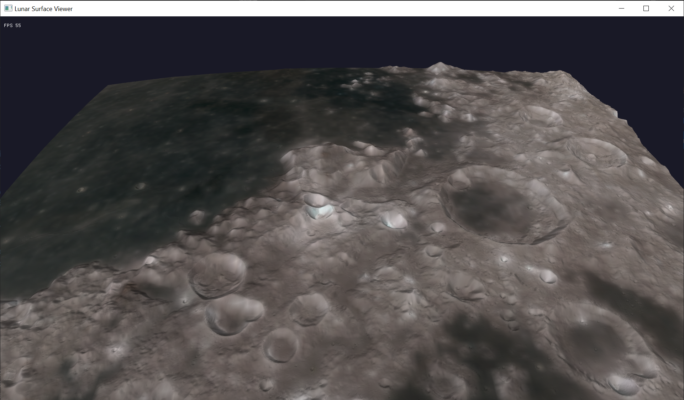

# Lunar Surface Viewer

High-performance 3D visualization of NASA's lunar elevation data with game-like navigation controls.

## Overview

This project provides a real-time OpenGL-based viewer for exploring high-resolution lunar surface data from NASA's LOLA (Lunar Orbiter Laser Altimeter) instrument. The viewer features smooth 60+ FPS rendering, intuitive orbit/FPS camera controls, and can handle massive 1.32 GB terrain files efficiently.

## Quick Start

### Build and Run

```bash
# Install dependencies (Ubuntu/Debian)
sudo apt-get install build-essential libglew-dev libglfw3-dev libglm-dev

# Build
make

# Run
./lunar_viewer
```

### First Time Setup

If you don't have data files yet:

```bash
# Download lunar elevation data (optional Python tool)
python scripts/download_dem.py
```

This downloads NASA LOLA elevation tiles (~1.32 GB each) to `.data/` directory.




## Features

- ✅ **Real-time 3D rendering** - 60-300+ FPS with OpenGL
- ✅ **Orbit camera mode** - Intuitive mouse controls (like Blender/Maya)
- ✅ **FPS fly mode** - Game-style WASD navigation
- ✅ **1024×1024 mesh** - Over 1 million vertices rendered smoothly
- ✅ **Terrain coloring** - Shader-based elevation visualization
- ✅ **Wireframe toggle** - See mesh structure
- ✅ **Fast loading** - Loads chunked data from 1.32 GB files in <1 second

## Controls

### Keyboard and Mouse
- **Left-click + drag** - Move camera
- **Right-click + drag** - Change light direction
- **Scroll wheel** - Zoom in/out
- **NumPad 0-9** - Move forward/back/left/right
- **Mouse** - Look around (cursor locked)
- **R** - Reset camera
- **ESC** - Quit

## Data Information

- **Source**: NASA LOLA (Lunar Orbiter Laser Altimeter)
- **Resolution**: 512 pixels per degree (~60 meters at equator)
- **Format**: 32-bit float, little-endian
- **Full tile size**: 23040 × 15360 pixels (~1.32 GB each)
- **Coverage**: 30° × 45° per tile
- **Values**: Elevation in meters relative to 1737.4 km radius sphere

## Building

### Using Make (Simple)
```bash
make                    # Build
make clean              # Clean build files
make install-deps       # Install dependencies (Ubuntu)
```

### Using CMake
```bash
mkdir build && cd build
cmake ..
make
./bin/lunar_viewer
```

## Python Tools (Optional)

Two Python utilities are provided for convenience:

1. **download_dem_data.py** - Download NASA elevation data
   ```bash
   pip install requests tqdm
   python download_dem_data.py
   ```

2. **demo.py** - Generate preview images (requires PyVista)
   ```bash
   pip install numpy pyvista
   python demo.py
   ```

These are optional - the C++ viewer is the main application.

## Troubleshooting

**Build errors?**
- Install dependencies: `sudo apt-get install libglew-dev libglfw3-dev libglm-dev`

**No data files?**
- Run `python download_dem_data.py` to download

**Black screen?**
- Check OpenGL drivers: `glxinfo | grep OpenGL`
- Update graphics drivers

**Low FPS?**
- May be using integrated GPU
- Check `nvidia-settings` if using NVIDIA

## Technical Details

- **Language**: C++17
- **Graphics**: OpenGL 3.3 Core
- **Libraries**: GLFW3, GLEW, GLM
- **Rendering**: Indexed triangles, VBO/EBO
- **Shaders**: Vertex + Fragment (terrain coloring)

## References

- LOLA Data: http://imbrium.mit.edu/DATA/SLDEM2015/
- Dataset: LRO-L-LOLA-4-GDR-V1.0
- Product: SLDEM2015

## License

Open source demonstration code. Free to use and modify.

## Notes

To work in Windows, the setup is a bit more complicated and involves setting up VSCode (or your IDE) to work with your compiler and build tools.